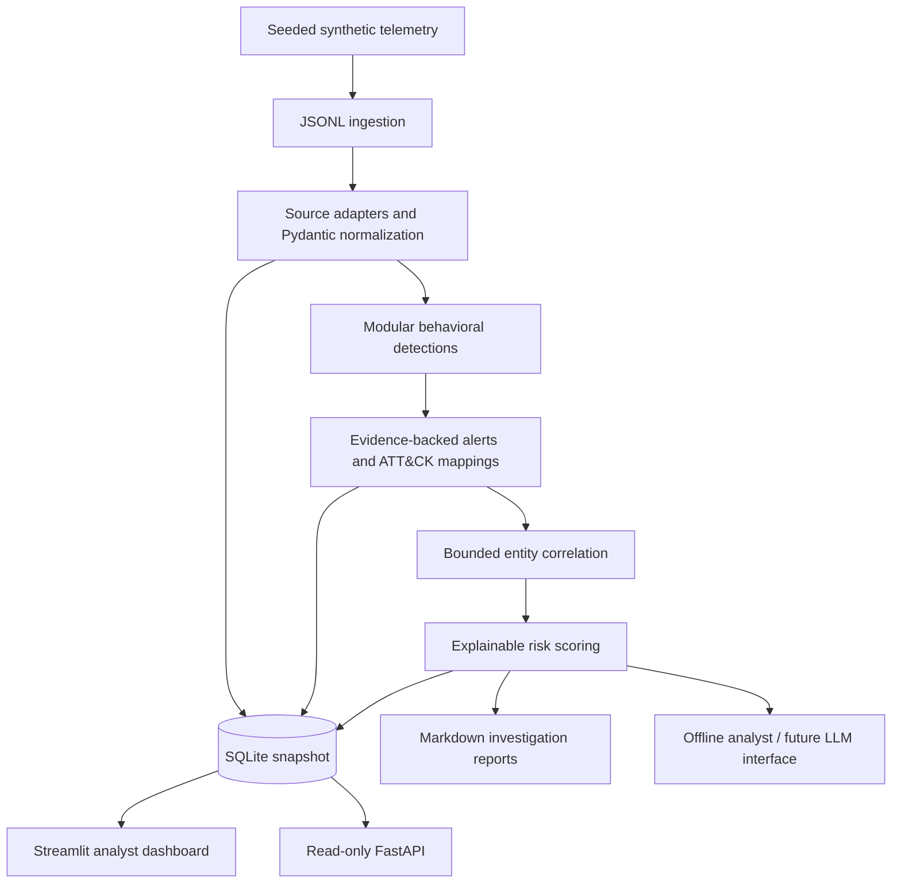

# AetherSOC — AI-Powered Mini Security Operations Center

**Turn synthetic endpoint and authentication telemetry into explainable alerts,
correlated incidents, and analyst investigation reports.** A local Python project
demonstrating junior SOC analysis and detection engineering. The AI component is
an offline analyst summary with a provider interface; no external LLM is implemented.

> Educational defensive lab, not a production SIEM. No scanning, exploitation,
> real attack execution, or external telemetry collection occurs.

## Dashboard preview

Screenshot placeholder: add `docs/images/dashboard.png` after capturing the local dashboard.
Screenshot placeholder: add `docs/images/investigation.png` showing the lab.admin timeline.
Screenshots should show only this synthetic dataset.

## Problem statement

Individual log entries provide limited context. A failed login could be a typo;
repeated failures followed by success and unusual process activity deserve review.
AetherSOC makes that reasoning visible instead of presenting an unexplained alert count.

## Architecture



## Features and workflow

1. Generate 1,200 benign events and 22 scenario events using seed 42.
2. Parse Windows-style and sensor records, validate fields, retain raw evidence.
3. Evaluate rolling authentication windows and process, identity and network rules.
4. Create stable alerts with event IDs, severity, actions and supported ATT&CK mappings.
5. Correlate evidence or matching user+host within a 30-minute maximum evidence span.
6. Score incidents transparently, persist a transactional SQLite snapshot and export reports.
7. Investigate in the dashboard; compare observations with hypotheses before recommending response.

Synthetic labels live separately from telemetry. Detection modules never consult them.
Safe encoded PowerShell in the dataset decodes to `Get-Date`; nothing is executed.

## Technology stack

Python 3.12, Pydantic, SQLite, Pandas, Streamlit, FastAPI, pytest and Ruff.
`requirements.txt` pins direct dependencies; `requirements-lock.txt` freezes the tested full environment.
There is no paid API requirement. No real-time collector or automatic containment exists.

## Implemented detections

| Rule | Logic | Alert severity | ATT&CK hypothesis |
|---|---|---|---|
| Brute Force | At least 5 failures/source in 300 seconds | HIGH | T1110 |
| Brute Force Followed by Success | At least 5 failures then success, same source/user/host | CRITICAL | T1110, T1078 |
| Multi-Account Authentication | At least 4 accounts failing from one source in 300 seconds | HIGH | T1110 |
| Suspicious PowerShell | Encoded/hidden execution or download/execute strings | HIGH | T1059.001 |
| Unusual Privileged Login | Privileged success outside 08:00–18:00 UTC lab hours | MEDIUM | T1078 |
| Unusual Login Location | Same account, two lab sites within 120 seconds | HIGH | T1078 |
| Suspicious Outbound Connection | Configured lab indicator, optionally following privileged success | MEDIUM/HIGH | None: insufficient protocol evidence |

Multi-account failures alone do not prove password spraying: password reuse is unknown.
Two fictional sites do not establish impossible travel. The rule flags unusual behavior only.
Thresholds and indicator destinations are in `app/config.py`.

## Sample incident

The default demo has **1,222 events, 9 alerts and 5 incidents**. Select the incident for
`lab.admin` in the dashboard: seven failures, successful privileged authentication,
encoded PowerShell, then a connection to `203.0.113.200`. Four related alerts become
one incident with score **100/100**, covering T1110, T1078 and T1059.001.
Read [the complete investigation](incidents/INCIDENT-001.md).
Stable incident IDs are evidence hashes; INCIDENT-001 is the human-readable demo reference.

## Dashboard

Five KPI cards summarize events, alerts, open incidents, critical alerts and high alerts.
Charts show severity, time, sources, users, rules and ATT&CK coverage. Select any incident
to inspect its evidence timeline, raw records, risk contributions and analyst actions.
Download a Markdown investigation report. Refresh after rerunning the analysis.

## Install (PowerShell, Windows)

Open this folder in VS Code. Use Python 3.12:

```powershell
python -m venv .venv
.\.venv\Scripts\python.exe -m pip install -r requirements-lock.txt
.\.venv\Scripts\python.exe -m app.cli demo
```

The prepared local environment already has dependencies installed. Activation is optional;
explicit Python paths avoid PowerShell activation policy issues. On Linux/macOS replace
`.\.venv\Scripts\python.exe` with `.venv/bin/python`.

## Run

```powershell
# Regenerate the dataset, run detections, correlate and export reports
.\.venv\Scripts\python.exe -m app.cli demo
# Start the dashboard (keep the terminal open)
.\.venv\Scripts\python.exe -m streamlit run dashboard/app.py --server.address 127.0.0.1 --server.port 8501
# Optional read-only API in another terminal
.\.venv\Scripts\python.exe -m uvicorn app.api:api --host 127.0.0.1 --port 8000
# Analyze an existing synthetic JSONL file
.\.venv\Scripts\python.exe -m app.cli analyze --input data/raw/events.jsonl
```

Dashboard: http://127.0.0.1:8501. API documentation: http://127.0.0.1:8000/docs.
Stop a foreground server with Ctrl+C. Bind only to loopback: the demo has no authentication.
`demo` replaces generated telemetry and the database snapshot; keep your own custom inputs elsewhere.

## Test and lint

```powershell
.\.venv\Scripts\python.exe -m app.cli demo
.\.venv\Scripts\python.exe -m pytest -q
.\.venv\Scripts\python.exe -m ruff check app dashboard scripts tests
```

Tests cover schema rejection, parsing, rolling-window boundaries, success matching,
multi-account behavior, safe/benign process inputs, stable alert IDs, risk contributions,
correlation bounds, shared-IP separation, SQLite idempotence, API and dashboard selection.
Demo-dependent integration tests intentionally verify seed-42 output. See [validation](docs/validation.md).

## Project structure

```text
app/         ingestion, normalization, models, detection, scoring,
             correlation, reporting, ai, CLI, storage and API
dashboard/   Streamlit investigation workspace
scripts/     deterministic data generator and PowerShell launcher
data/        raw input, processed snapshot, separate synthetic labels
sigma_rules/ portable detection examples and correlation guidance
incidents/   committed recruiter demonstration investigation
reports/     generated reports (ignored)
docs/        architecture, scoring, ATT&CK, validation, interview and resume guides
tests/       unit, integration, API and dashboard checks
```

## Security limitations

Everything is synthetic; no measured enterprise accuracy or attack prevention is claimed.
The in-memory batch engine has no streaming watermark, late-event processing or distributed scale.
Correlation uses evidence and user/host associations, not session-level causality.
The dashboard renders trusted local data; do not expose it or feed untrusted external logs without
input limits, safe report rendering, authentication and access controls. Reports may contain raw
command lines. Sigma examples are not loaded by the Python engine and need backend validation.
The optional AI interface is a stub with deterministic text, not an implemented hosted AI service.
Read [SECURITY.md](SECURITY.md) before adapting the lab.

## Future improvements

Add event-source plugins, YAML-driven rule settings, session-aware correlation, baseline tuning,
durable incident state, replay metrics, Sigma backend conversion, authenticated deployment,
streaming queues and an opt-in redacted LLM provider with human review.

## What I learned

Normalization separates vendor formats from behavior. Detection windows reduce noise but require
tuning. Evidence provenance makes alerts auditable. Correlation creates investigation context
without proving causality. Explainable scoring supports prioritization, while ATT&CK mapping
communicates hypotheses consistently. See [interview guide](docs/interview-guide.md) and
[truthful resume material](docs/resume-material.md).
